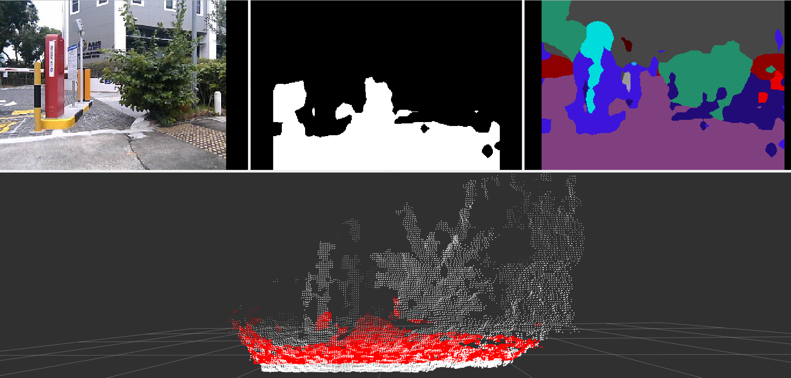

# Pseudo-LiDAR Perception Pipeline

---

## Overview

This project provides a modular ROS-based perception pipeline for generating pseudo-LiDAR point clouds from RGB-D data. It is designed for CPU efficiency and easy reproducibility, and is suitable for robotics applications such as freespace detection and navigation.

## Example Output
Below is an example visualization from the pipeline:
- **Images:** Input RGB image, output ground mask, and output segmentation mask.
- **Point Clouds:** Point cloud visualizations showing the original point cloud (white) and the projected ground points (red).



---

## Segmentation Model

**Model Used:** [Fast-SCNN (Cityscapes)](https://github.com/Tramac/Fast-SCNN-pytorch)
- **Why:** Fast-SCNN is a lightweight, high-throughput semantic segmentation model designed for real-time applications and is efficient on CPU. Pretrained weights on Cityscapes are available and suitable for urban/road scenes.
- **Training Pipeline:** [Fast-SCNN Training Repo](https://github.com/Tramac/Fast-SCNN-pytorch)

---

### Model Comparison: Fast-SCNN vs MobileNetV2-UNet vs DeepLabV3

| Model              | mIoU (Cityscapes) | FPS (1024x2048, Titan Xp) | Parameters (M) | Notes |
|--------------------|-------------------|---------------------------|---------------|-------|
| **Fast-SCNN**      | 68.0              | 123.5                     | 1.11          | Extremely fast, low memory, real-time on embedded devices |
| **MobileNetV2-UNet** | ~70 (varies by dataset) | ~30-50 (varies by device/resolution) | ~6.6 | Good balance, but slower than Fast-SCNN, higher accuracy than Fast-SCNN on some datasets |
| **DeepLabV3**      | 77.2 (ResNet-101 backbone) | ~20-22                  | 15.9          | High accuracy, but much slower and heavier |

- **Speed (FPS):** Fast-SCNN is designed for real-time and embedded use, achieving over 120 FPS on high-end GPUs at full resolution. MobileNetV2-UNet is much faster than traditional UNet but slower than Fast-SCNN. DeepLabV3 is accurate but not real-time on most hardware.
- **Accuracy (mIoU):** DeepLabV3 achieves the highest accuracy, followed by MobileNetV2-UNet, then Fast-SCNN. However, Fast-SCNN's accuracy is competitive for real-time applications.
- **Throughput:** Fast-SCNN offers the best throughput for real-time robotics and edge applications, while DeepLabV3 is best for offline, high-accuracy needs.

---

## Projection Method

- **Technique:**
  - Pinhole camera projection using camera intrinsics (and extrinsics if needed) to map 2D image pixels to 3D points.

- **Preprocessing:**
  - Crop the top of the RGB image so the height is divisible by 32 and matches the model input size. Cropping from the top region assumes that there will be no ground regions in the topmost region of the image.(see `img_utils.crop_top_to_div32`).
  - Scale camera intrinsics to match the compressed rgb and depth images (`projection_utils.load_and_scale_intrinsics`). Assumption: 1024x768 depth and 640x360 rgb from commonly used RealSense camera setups.
  - Note: RGB and Depth images have different intrinsic parameters but are aligned extrinsically. If RGB and depth sensors are offset, apply extrinsic calibration to align their frames.

- **Mask & Depth Alignment:**
  - Run segmentation on the cropped RGB image to obtain a ground/freespace mask (`img_utils.run_segmentation`).
  - The pretrained Fast-SCNN model outputs 19 classes. Only classes road, sidewalk, and terrain were selected as part of ground region.
  - Since camera and depth images do not have consistent intrinsics, reproject the mask from the RGB frame to the depth frame using their respective configs. (see `projection_utils.reproject_mask_rgb_to_depth`).

- **3D Projection:**
  - For each ground pixel, use the depth value and the (scaled) camera intrinsics to project to 3D coordinates (`projection_utils.project_mask_to_3d`).
  - Convert 3D points from OpenCV to ROS coordinate convention (`projection_utils.convert_to_ros_coords`).

- **Pipeline Steps:**
  1. Crop RGB image (top, div 32)
  2. Run segmentation to get ground mask
  3. Reproject ground mask from rgb to depth frame using rgb and depth intrinsics
  4. Project ground pixels to 3D using depth parameters
  5. Convert to ROS coordinates and publish as `sensor_msgs/PointCloud2`

- **Implementation Notes:**
  - Cropping is always from the top, as the top of the image is least likely to contain ground.
  - All projection and reprojection steps use the correct, resolution-matched intrinsics for each image.
  - If sensors are offset, extrinsic calibration is required for correct 3D alignment.
  - Only valid (nonzero) RGB and depth values are used for 3D projection.
  - The pipeline is robust to different resolutions and intrinsics for RGB and depth images, and can handle both aligned and misaligned sensor pairs.

- **Key Utility Modules:**
  - `projection_utils.py`: intrinsics scaling, mask reprojection, 3D projection, ROS coordinate conversion
  - `img_utils.py`: cropping, preprocessing, segmentation, mask handling
  - `seg_constants.py`: Cityscapes class indices for ground/freespace

---

## Final Outputs

- **Pseudo-LiDAR ROS Bag:**
  - Contains `/pseudo_lidar/points`, `/tf_static`, and `/perception/camera_front_straight/depth/points` topics.
  - Output bags:
    - `road_traversal.bag` (from `outdoor_road.bag`)
    - `tiled_area.bag` (from `semi_outdoor.bag`)
- **Additional Topics (for debugging/visualization):**
  - `/pseudo_lidar/semantic_mask`
  - `/pseudo_lidar/ground_mask`  - `/perception/camera_front_straight/rgb/image`
Download Final Rosabgs [here](https://drive.google.com/file/d/1RUIpfbKjYaD_zO1uUA9jy8u-fKN9H_lj/view?usp=sharing). Place in `/root/pseudo_lidar_pipeline/rosbags`.
---

## Setup

### Quick Visualization of Results

If you want to quickly visualize the results using a pre-generated output results bag, simply run:

```bash
rviz -d ~/pseudo_lidar_pipeline/rviz/segnode.rviz
rosbag play /root/pseudo_lidar_pipeline/rosbags/road_traversal.bag

rviz -d ~/pseudo_lidar_pipeline/rviz/segnode.rviz
rosbag play /root/pseudo_lidar_pipeline/rosbags/tiled_area.bag

```
This will show the pseudo-lidar point cloud and related topics in RViz using the provided configuration.

---

### Running on Your Own

To run the segmentation pipeline and generate pseudo-lidar results from scratch:

1. **Start RViz:**
   ```bash
   rviz -d ~/pseudo_lidar_pipeline/rviz/segnode.rviz
   ```
2. **Run the segmentation node:**
   ```bash
   rosrun segmentation_node seg_node.py
   ```
3. **Play a bag file:**
   ```bash
   rosbag play /root/pseudo_lidar_pipeline/rosbags/outdoor_road.bag
   ```

You can also record the output as follows:
```bash
rosbag record -O <output_bag.bag> \
  /pseudo_lidar/points /tf_static /perception/camera_front_straight/depth/points \
  /pseudo_lidar/semantic_mask /pseudo_lidar/ground_mask /perception/camera_front_straight/rgb/image
```

---

### Full Setup Instructions

1. **Clone the repository:**
   ```bash
   git clone https://github.com/patrickeala/pseudo_lidar_pipeline.git
   cd pseudo_lidar_pipeline
   ```
2. **Build the Docker image:**
   ```bash
   docker build --no-cache -t pseudo_lidar_dev .
   ```
3. **Allow Docker containers to access X11 (for RViz/GUI support):**
   ```bash
   xhost +local:root
   ```
4. **Run the Docker container with the repository mounted:**
   ```bash
   docker run -d \
       --name pseudo_lidar_dev \
       -e DISPLAY=$DISPLAY \
       -v /tmp/.X11-unix:/tmp/.X11-unix \
       -v $(pwd):/root/pseudo_lidar_pipeline \
       --network host \
       --privileged \
       pseudo_lidar_dev \
       tail -f /dev/null
   ```
   - This will start the container in the background. You can then `docker exec -it pseudo_lidar_dev bash` to get a shell inside the container.

5. **Build the ROS workspace (inside the container):**
   ```bash
   cd /root/pseudo_lidar_pipeline/catkin_ws
   catkin_make
   source devel/setup.bash
   ```

6. **Downloading ROS bags:**
   - Download the example ROS bag files from [this link](https://drive.google.com/file/d/1RUIpfbKjYaD_zO1uUA9jy8u-fKN9H_lj/view?usp=sharing). This zip contains the input rosbags for the assignment as well as the saved outputs.
   - Place the downloaded `.bag` files in `/root/pseudo_lidar_pipeline/rosbags`.

---

## Future Work

- **Leverage Depth Images and Point Clouds:**
  - Use both raw depth images and depth point clouds from the sensor to improve 3D reconstruction.
  - Cross-check these sources to filter outliers, fill missing areas, and create cleaner pseudo-LiDAR data.
  - Explore using extra depth features like surface normals or height maps for better segmentation.

- **Sensor Fusion with LiDAR:**
  - Combine data from traditional LiDAR and pseudo-LiDAR (from RGB-D) for more accurate and robust results.
  - Fuse both sources to cover each other's weaknesses, especially in challenging conditions (e.g., bright sunlight, reflective surfaces).
  - Perform fusion at the point cloud or BEV (bird's-eye view) level to improve freespace detection and obstacle avoidance.

- **C++ Pipeline Implementation:**
  - Port the current Python pipeline to C++ for better speed and real-time performance, especially on resource-limited hardware.
  - Export the Fast-SCNN model to ONNX or TorchScript and use a fast C++ inference engine (LibTorch, ONNX Runtime).
  - Easier integration with other robotics systems and reduced overall latency.

- **Model Optimization:**
  - Optimize the segmentation model with TensorRT, quantization, or pruning.
  - Improve inference speed and efficiency, enabling more complex or accurate models on edge devices while keeping real-time performance.

---

**For any questions, feel free to reach out to Patrick Eala at patrick.eala@gmail.com.**
